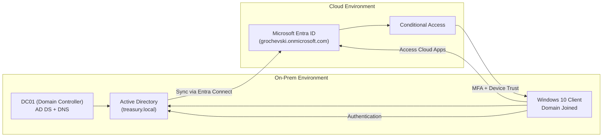
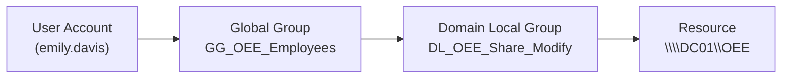
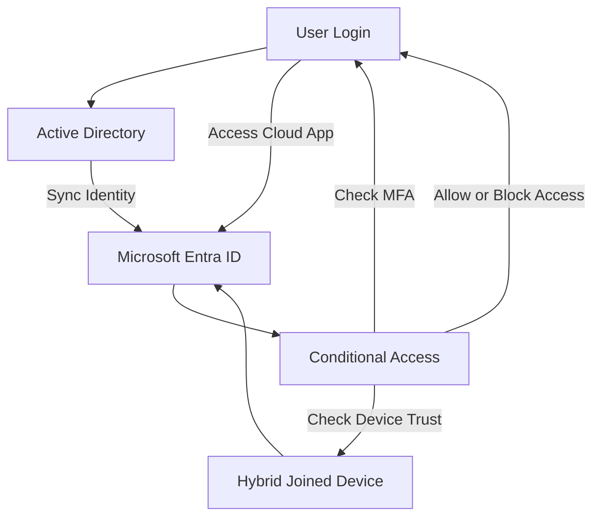
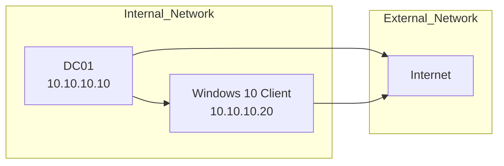

# Hybrid Identity and Access Management (IAM) Lab

## Project Overview

This project demonstrates the design, implementation, and validation of a Hybrid Identity and Access Management (IAM) environment integrating on-premises Active Directory with Microsoft Entra ID.

The lab began as a traditional on-prem AD environment and was later upgraded to a hybrid architecture using Microsoft Entra Connect Sync.

The objective was to simulate how real organizations manage:

* On-prem identity
* Cloud identity
* Device identity
* Authentication and authorization
* Conditional Access
* Zero Trust access control

---

## Architecture Overview

The lab is built using a hybrid identity model where:

* Active Directory acts as the on-prem identity provider
* Microsoft Entra ID acts as the cloud identity platform
* Microsoft Entra Connect synchronizes identities between environments
* Conditional Access enforces security controls

---

## Architecture Diagram

---

## Authorization Model (AGDLP)

---

## Authentication and Access Flow

---

## Network Architecture

---

## Phase 0 — Active Directory Foundation

* Deployed Windows Server 2019 Domain Controller (DC01)
* Configured AD DS and DNS
* Domain: treasury.local
* Verified domain join and authentication

### Organizational Structure

* Corp-Users (department-based OUs)
* Corp-Groups (Global and Domain Local)
* Corp-Computers
* Corp-Admins

Departments:

* ABCC
* CashManagement
* CleanWaterTrust
* DebtManagement
* IT
* MSRB
* OEE
* UnclaimedProperty
* VeteransBonus

---

## Identity and Access Model (AGDLP)

Accounts → Global Groups → Domain Local Groups → Permissions

* Users assigned to Global Groups
* Global Groups nested into Domain Local Groups
* Permissions assigned only to Domain Local Groups

---

## File Share and Authorization

Resource:

* Local path: C:\TreasuryShares\OEE
* Share: \DC01\OEE

Permissions:

* DL_OEE_Share_Read → Read
* DL_OEE_Share_Modify → Modify

---

## Authentication Validation

Validated using:

klist

Confirmed Kerberos:

* Ticket Granting Ticket (TGT)
* Service tickets

---

## Group Policy (Security Baseline)

Configured:

* Password complexity
* Minimum length
* Account lockout

---

## Phase 1 — Network and Hybrid Readiness

Issues resolved:

* APIPA addressing
* DNS misconfiguration
* No internet connectivity

Fixes:

* Correct NIC roles
* DNS pointing to DC
* DNS forwarders added
* Connectivity validated

---

## Phase 2 — Microsoft Entra ID

* Tenant created: grochevski.onmicrosoft.com
* Admin account configured

Used for:

* Identity management
* Conditional Access
* Device visibility

---

## Phase 3 — Entra Connect Sync

* Installed on DC01
* Express configuration

Result:

* AD users synchronized to Entra ID
* AD remained source of truth

---

## Phase 4 — MFA and Conditional Access

Policy:

Require MFA for all users

* All users included
* Admin excluded
* All apps targeted

---

## Phase 5 — Risk-Based Access

Configured:

* Sign-in Risk → Require MFA
* User Risk → Require Password Change

---

## Phase 6 — Hybrid Device Join

Initial issue:

* Device not Azure AD joined

Fixes:

* Time sync corrected
* SCP configured
* Device properly registered

Validation:

dsregcmd /status

Result:

* AzureAdJoined: YES
* DomainJoined: YES

---

## Phase 7 — Device-Based Conditional Access

Policy:

Require Hybrid Joined Device

Result:

* Trusted devices allowed
* Untrusted devices blocked

---

## Phase 8 — Access Validation

* Trusted device → Access granted
* Untrusted device → Access denied

---

## Writeback Model

* AD → Entra ID sync only
* AD remains source of truth

---

## Key Concepts Demonstrated

Identity Infrastructure
Authentication
Authorization
Hybrid Identity
Zero Trust
Troubleshooting

---

## Final Outcome

* Hybrid identity fully functional
* MFA enforced
* Conditional Access active
* Device trust enforced
* Zero Trust validated

---

## Portfolio Summary

Built a Hybrid Identity and Access Management lab integrating on-prem Active Directory with Microsoft Entra ID using Entra Connect Sync. Implemented Kerberos authentication, AGDLP authorization, hybrid identity synchronization, MFA, Conditional Access, and device-based Zero Trust enforcement. Validated secure access by allowing only trusted hybrid-joined devices and blocking unmanaged endpoints.
