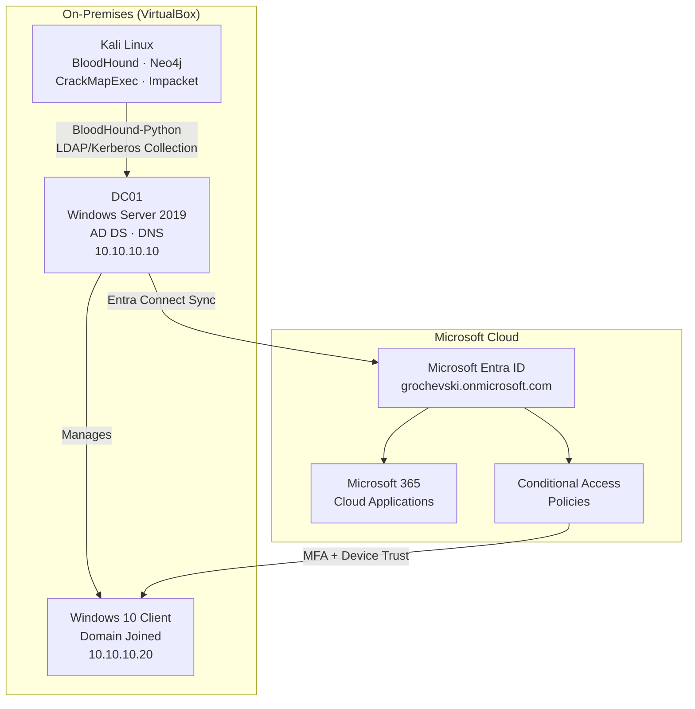
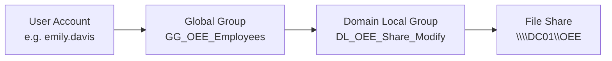
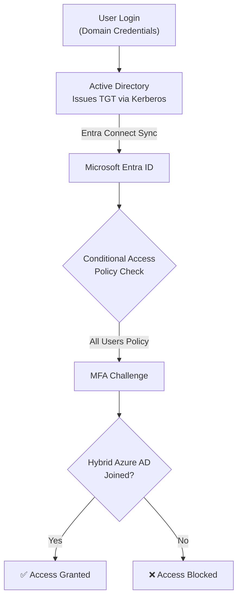
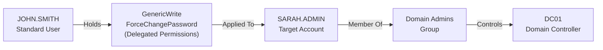

# Hybrid Identity & Access Management Lab


---

## What This Project Demonstrates

This lab combines enterprise IAM administration with an identity security assessment — the same two-sided discipline that IAM teams practice in production environments.

| Skill Area | What Was Built |
|---|---|
| Active Directory Administration | AD DS, DNS, OUs, users, groups, GPOs, delegated admin |
| Microsoft Entra ID | Tenant setup, cloud identities, admin roles |
| Hybrid Identity | Entra Connect Sync, Password Hash Sync, AD as source of truth |
| RBAC & Access Governance | AGDLP model, least privilege, group-based permissions |
| Conditional Access & Zero Trust | MFA enforcement, device trust, risk-based policies |
| Identity Security Assessment | BloodHound ACL analysis, privilege escalation path discovery |
| Attack Validation | CrackMapExec (credential testing), Impacket secretsdump |
| Troubleshooting | DNS, NIC/APIPA, time sync, SCP, device registration, sync delays |

---

## Overview

This project simulates a modern enterprise hybrid identity environment — integrating on-premises Active Directory with Microsoft Entra ID and Microsoft 365 — then analyzes it for identity-based security risks using BloodHound, CrackMapExec, and Impacket.

The lab was built in two distinct phases: **administration** (building and managing the identity infrastructure) and **security assessment** (analyzing it for privilege escalation paths, validating findings, and demonstrating impact).

**Key outcomes:**
- Functional hybrid identity sync between `treasury.local` and `grochevski.onmicrosoft.com`
- Conditional Access enforcing MFA and device trust for all users
- BloodHound identified a valid privilege escalation path from a standard user to Domain Admin
- Attack path validated end-to-end: permission discovery → password reset → authentication → credential access

---

## Architecture



---

## Lab Environment

| Component | Details |
|---|---|
| Domain Controller | DC01 · Windows Server 2019 · 10.10.10.10 |
| Client | Windows 10 · Domain Joined · 10.10.10.20 |
| Cloud Tenant | Microsoft Entra ID · grochevski.onmicrosoft.com |
| Security Platform | Kali Linux · BloodHound CE · Neo4j |
| Domain | treasury.local |
| Users | 15+ user accounts across 9 departments |
| Groups | 10+ security groups (Global + Domain Local) |
| OUs | 9 departmental OUs + Corp-Groups, Corp-Computers, Corp-Admins |
| GPOs | Password policy, account lockout, security hardening |

---

## Organizational Structure

```
treasury.local
├── Corp-Users
│   ├── ABCC
│   ├── CashManagement
│   ├── CleanWaterTrust
│   ├── DebtManagement
│   ├── IT
│   ├── MSRB
│   ├── OEE
│   ├── UnclaimedProperty
│   └── VeteransBonus
├── Corp-Groups
│   ├── Global Groups       (GG_ prefix)
│   └── Domain Local Groups (DL_ prefix)
├── Corp-Computers
└── Corp-Admins
```

---

## Authorization Model (AGDLP)

Access to file share resources follows the AGDLP model — the enterprise-standard approach for scalable AD authorization.



> Permissions are assigned **only** to Domain Local Groups. No user ever receives direct resource access.

---

## Hybrid Identity & Conditional Access



**Policies configured:**
- Require MFA for all users across all cloud applications
- Sign-in risk → Require MFA (Identity Protection)
- User risk → Require password change
- Require Hybrid Azure AD Joined device for resource access

Hybrid join validated with:
```powershell
dsregcmd /status
# AzureAdJoined : YES
# DomainJoined  : YES
```

---

## Security Assessment — BloodHound Analysis

After building and validating the IAM environment, a security assessment was performed to determine whether misconfigured delegated permissions created privilege escalation paths. This phase reflects the defensive identity security work IAM teams perform in production environments.

### Methodology

```
1. Data Collection
   BloodHound-Python collected users, groups, computers,
   sessions, ACLs, and group memberships via LDAP/Kerberos

2. Attack Path Analysis
   BloodHound + Neo4j graphed AD object relationships
   and surfaced permission-based attack paths

3. Manual Validation
   Findings verified in ADUC by reviewing security
   descriptors and confirming delegated rights

4. Controlled Exploitation
   Attack path executed in isolated lab to confirm
   real-world impact of the misconfiguration

5. Findings Documentation
   Risk, impact, and severity documented;
   remediation recommendations produced
```

### Privilege Escalation Path Discovered

BloodHound identified the following attack path:



**Translation:** A standard user (`john.smith`) held delegated permissions that allowed resetting the password of `sarah.admin`, who was a member of Domain Admins — enabling a full path from standard user to domain compromise.

### Validation Steps

**Step 1 — BloodHound Discovery**

BloodHound-Python collected AD data and Neo4j graphed the relationship. `GenericWrite` and `ForceChangePassword` permissions were identified on `SARAH.ADMIN` with `JOHN.SMITH` as the principal.

**Step 2 — Manual Permission Verification (ADUC)**

Confirmed in Active Directory Users and Computers:
- Security descriptor on `sarah.admin` showed `JOHN.SMITH` with `GenericWrite` and `Reset Password` rights
- Rights confirmed as directly delegated, not inherited

**Step 3 — Password Reset**

Delegated `ForceChangePassword` right used to reset `sarah.admin`'s password in a controlled test.

**Step 4 — Authentication Validation (CrackMapExec)**

```bash
crackmapexec smb <DC_IP> -u sarah.admin -p <new_password>
# Result: [+] treasury.local\sarah.admin:<password> (Pwn3d!)
```

Authentication succeeded — account takeover confirmed via delegated permission.

**Step 5 — Impact Demonstration (Impacket)**

```bash
impacket-secretsdump treasury.local/sarah.admin:<password>@<DC_IP>
# Result: Credential material successfully retrieved
```

Domain Admin credential access demonstrated — showing potential for full domain compromise through identity misconfiguration.

---

## Security Findings

| # | Finding | Risk | Impact | Severity |
|---|---|---|---|---|
| 1 | Excessive delegated password reset rights on privileged account | Low-privileged user can reset DA account password | Unauthorized account takeover | 🔴 High |
| 2 | GenericWrite permissions on privileged user | Attacker can modify target user attributes | Privilege escalation | 🔴 High |
| 3 | Privileged group membership of compromised account | Sarah.Admin is a Domain Admin | Potential domain-wide compromise | 🔴 Critical |
| 4 | Attack path invisible without tooling | Path not discoverable through standard admin review | Undetected escalation risk | 🟠 Medium |
| 5 | Hybrid identity governance gap | Privileged on-prem accounts sync to cloud tenant | Cloud resource exposure | 🟠 Medium |

---

## MITRE ATT&CK Mapping

| Activity | Technique | ID |
|---|---|---|
| AD user and group enumeration | Account Discovery | T1087 |
| Group membership analysis | Permission Groups Discovery | T1069 |
| BloodHound relationship mapping | Domain Trust Discovery | T1482 |
| Delegated password reset | Account Manipulation | T1098 |
| Authentication with reset credentials | Valid Accounts | T1078 |
| Domain credential extraction | OS Credential Dumping | T1003 |

---

## Build Phases

| Phase | Focus | Key Activities |
|---|---|---|
| 0 | AD Foundation | Windows Server 2019, AD DS, DNS, domain promotion, `treasury.local` |
| 1 | Network & Hybrid Readiness | APIPA fix, NIC roles, DNS forwarders, internet connectivity |
| 2 | Directory Administration | 15+ user accounts, 10+ groups, 9 dept OUs, AGDLP model |
| 3 | Group Policy | Password complexity, account lockout, security hardening |
| 4 | Microsoft Entra ID | Tenant creation, cloud identities, admin roles, M365 integration |
| 5 | Entra Connect Sync | Express config, Password Hash Sync, identity synchronization verified |
| 6 | Conditional Access & MFA | MFA-for-all policy, risk-based policies, break-glass admin excluded |
| 7 | Hybrid Device Join | SCP config, time sync fix, `dsregcmd` validation, device-based CA policy |
| 8 | Security Assessment | BloodHound collection, attack path analysis, CME/Impacket validation |

---

## Tools & Technologies

**Identity & Directory**
`Active Directory DS` `Microsoft Entra ID` `Microsoft 365` `Entra Connect Sync` `Windows Server 2019` `Windows 10`

**Administration**
`ADUC` `GPMC` `DNS Manager` `PowerShell` `dsregcmd` `klist`

**Networking & Auth**
`DNS` `DHCP` `Kerberos` `LDAP` `Password Hash Sync`

**Security Assessment**
`BloodHound CE` `BloodHound-Python` `Neo4j` `CrackMapExec` `Impacket` `Kali Linux`

---

## Repository Structure

```
IAM-Hybrid-Identity-Lab/
├── docs/               # Phase documentation and lab notes
├── images/             # Architecture diagrams, BloodHound screenshots, validation evidence
└── README.md
```

---

## Key Takeaways

Building this lab as both an IAM administrator and a security assessor revealed how quickly standard delegation mistakes create high-severity attack paths — and why manual reviews alone are insufficient for detecting them. BloodHound surfaces relationships that no spreadsheet-based access review would catch, which is exactly why understanding identity attack paths is a core competency for IAM teams operating in AD environments.

---

*Built as a portfolio project demonstrating enterprise IAM administration, hybrid identity, and identity security assessment. All security testing was performed in an isolated, controlled lab environment.*
