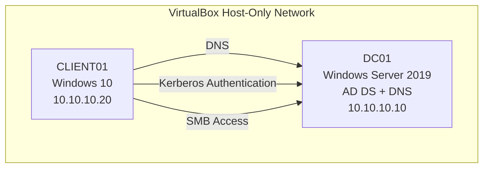

# Active Directory Identity & Access Management Lab

## Overview

This project demonstrates a hands-on Identity & Access Management lab built using Microsoft Active Directory in a virtualized environment.

The lab simulates a small enterprise identity infrastructure and demonstrates core IAM concepts including:

- Active Directory Domain Services (AD DS)
- DNS-based service discovery
- Kerberos authentication
- Role-Based Access Control (RBAC)
- AGDLP group nesting model
- NTFS permission management
- Group Policy security controls
- Identity lifecycle actions such as provisioning and access revocation

The objective of this project is to demonstrate practical identity administration and access control mechanisms used in enterprise Windows environments.

---

# Lab Architecture

**Virtualization Platform:** Oracle VirtualBox  
**Network Type:** Host-Only Network  
**Domain:** `treasury.local`

| System | Role | Operating System | IP Address |
|------|------|------|------|
| DC01 | Domain Controller | Windows Server 2019 | 10.10.10.10 |
| CLIENT01 | Domain-Joined Workstation | Windows 10 | 10.10.10.20 |

### Server Roles Installed

**DC01**

- Active Directory Domain Services (AD DS)
- DNS Server

The Windows client uses the Domain Controller as its DNS server, enabling:

- Active Directory service discovery
- domain authentication
- Kerberos ticket issuance

---

# Network Diagram



---

# IAM Capabilities Demonstrated

This lab demonstrates several core Identity & Access Management capabilities.

### Active Directory Administration

- Domain controller deployment
- Organizational Unit design
- user and group management

### Role-Based Access Control

Access control is implemented using Microsoft's recommended **AGDLP model**.

```
Accounts → Global Groups → Domain Local Groups → Permissions
```

This structure ensures permissions are assigned through roles rather than directly to users.

### Identity Lifecycle Simulation

Basic IAM lifecycle scenarios were tested:

- user provisioning
- group membership changes
- access revocation
- access restoration

### Group Policy Security Controls

Domain-wide account security policies were implemented through the **Default Domain Policy**.

---

# Authentication Validation

Kerberos authentication was validated on the domain-joined client using:

```powershell
klist
```

Observed tickets:

```
krbtgt/TREASURY.LOCAL
```

Ticket Granting Ticket issued at logon.

```
cifs/DC01
```

Service ticket issued when accessing the network share.

Authentication flow:

```
User login
    ↓
Domain Controller validates credentials
    ↓
Ticket Granting Ticket issued
    ↓
Service ticket requested
    ↓
CIFS ticket issued
    ↓
Access to \\DC01\oee
```

---

# Access Control Validation

### File Share

```
\\DC01\oee
```

Local folder:

```
C:\TreasuryShares\OEE
```

### NTFS Permissions

```
DL_OEE_Share_Read → Read
DL_OEE_Share_Modify → Modify
Domain Admins → Full Control
```

### Authorization Tests

The following tests were performed from the client workstation:

- authorized user successfully accessed the share
- unauthorized user received **Access Denied**
- removing a user from the group revoked access
- re-adding the user restored access

These tests validated group-based authorization using the AGDLP model.

---

# Documentation

Detailed documentation for the lab components:

- **Lab Architecture**  
  `docs/lab-architecture.md`

- **Active Directory Configuration**  
  `docs/active-directory-configuration.md`

- **Kerberos Authentication**  
  `docs/kerberos-authentication.md`

- **RBAC and Access Control**  
  `docs/rbac-access-control.md`

- **Group Policy Security**  
  `docs/group-policy-security.md`

- **Security Logging**  
  `docs/security-logging.md`

---

# Skills Demonstrated

- Active Directory administration
- Identity and access management
- Kerberos authentication
- RBAC implementation
- NTFS permission management
- Group Policy security configuration
- Windows enterprise identity infrastructure
